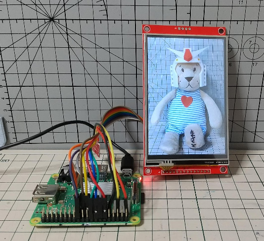

# ili9488_for_adafruit_rgb_display



## Overview
The ili9488_for_adafruit_rgb_display is an additional driver for adafruit-circuitpython-rgb-display.

## How to use
* Clone ili9488_for_adafruit_rgb_display (or download)
  ```
  $ clone https://github.com/rsna6ce/ili9488_for_adafruit_rgb_display.git
  ```
* Install libraries
````
$ pip3 install adafruit-circuitpython-rgb-display
$ pip3 install numpy
$ pip3 install pillow
````
* Install ili9488.py
  * Show location path of adafruit-circuitpython-rgb-display
    ```
    $ pip3 show adafruit-circuitpython-rgb-display
    ...
    Location: /home/(YOUR_USERNAME)/.local/lib/python3.9/site-packages
    ...
    ```
    * In this case, `/home/(YOUR_USERNAME)/.local/lib/python3.9/site-packages` is location path <br><br>
  * copy ili9488.py into `location path` / `adafruit_rgb_display`
    ```
    $ cp ili9488_for_adafruit_rgb_display/ili9488.py /home/(YOUR_USERNAME)/.local/lib/python3.9/site-packages/adafruit_rgb_display/.
    ```
* Run sample.py
````
$ cd ili9488_for_adafruit_rgb_display
$ python3 sample.py
````

## The operating environment confirmed
* Rasberry Pi3 Model A+
  * Raspberry Pi OS with desktop 32bit (bullseye)
* 4" SPI TFT LCD Display, 4" ILI9488 Touch Panel LCD 480x320 3.3V 5V, with Memory Card Slot, LCD Screen Module with Stylus
  * https://www.amazon.co.jp/dp/B0C3Y6M3BZ/
* wireing
  
| raspi pin no | raspi pin name | device name | device pin |
| ---: | :--- | :--- | :--- |
| 21 | GPIO9(SPI0 MISO) | LCD | SDO(MISO) |
| 12 | GPIO18 | LCD | LED |
| 23 | GPIO11(SPI0 SCLK) | LCD | SCK |
| 19 | GPIO10(SPI0 MOSI) | LCD | SDI(MOSI) |
| 18 | GPIO24 | LCD | DC |
| 16 | GPIO23 | LCD | RESET |
| 24 | GPIO8(SPI0 CS0) | LCD | CS |
| 14 | Ground | LCD | GND |
| 17 | 3V3 Power | LCD | VCC |

## Note
* SPI read from device with optional command not supported.
* In raspberry pi3 environment, the baudrate may be increased to 50000000 Hz. To speed up screen refresh.
